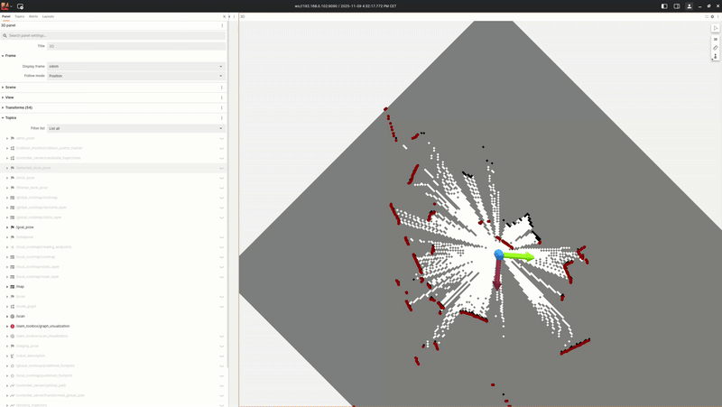

==========================
Mapping on the TurtleBot4
==========================

In this section, we will cover the steps required to perform mapping using the TurtleBot4 robot platform.

The goal is to generate a 2D occupancy grid map of the environment using the robot's onboard rplidar.

For that we want to run mapping in combination with lichtblick for visualization and a joystick or the keyboard teleoperation for controlling the robot.

First make sure you can see ros topics from the robot on your PC.
Please refer to the :doc:`TurtleBot4 Setup </turtlebot4/turtlebot4>` section for details on how to connect to the robot and set the correct ROS_DOMAIN_ID

Launch Mapping on the Robot
===========================

Go to the robot via ssh like shown in the :doc:`TurtleBot4 Setup </turtlebot4/turtlebot4>` section.

Best way to keep the slam running by using tmux or screen.

.. code-block:: bash

    ssh ubuntu@<robot_ip_address>
    tmux new
    ros2 launch turtlebot4_navigation slam.launch.py

On your devcontainer / PC start teleop keyboad to control the robot.

.. code-block:: bash

    ros2 run teleop_twist_keyboard teleop_twist_keyboard --ros-args -p stamped:=true

Important here is to actually run it with stamped:=true because with latest changes in ROS2 the hardware topics expect a `geometry_msgs/TwistStamped` message.

Now move the robot around to map the environment.

To save the map one can use the map_saver node from map_server package.

.. code-block:: bash

    ros2 run nav2_map_server map_saver_cli -f "map_name" --ros-args -p map_subscribe_transient_local:=true

This will save two files `map_name.yaml` and `map_name.pgm` in the current directory.

Afer generating the map on the robot one needs to move the files into the envs folder within the roscon folder under

.. code-block:: bash

    /home/ubuntu/roscon_de_2025_navigation_workshop/envs/

This map will be used to navigate the robot in the next section.
