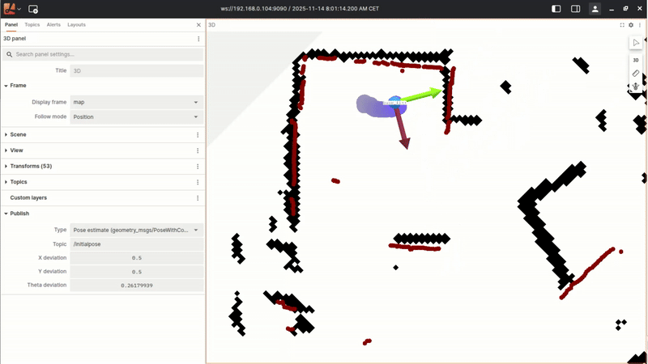

=======================
Nav2 on the TurtleBot4
=======================

In this section, we will cover the steps required to perform navigation using the TurtleBot4 robot platform.

General Setup
=============

The Turtlebot4 runs with a Raspberry Pi 4 as main computer. This is quiet small when it comes to power and performance.

In case you encounter slow startup times for nodes or docker containers please be patient and wait a bit longer.

To start navigation on the turtlebot please go into the roscon_de_2025_navigation_workshop/turtlebot4_navigation/ folder and start the navigation stack with: folder and run.

.. code-block:: bash

   docker compose up -d

This should start two containers, one for the localization and one for the navigation stack.

.. code-block:: bash

   docker ps

You should see something like this:

.. code-block:: bash

    CONTAINER ID   IMAGE                          COMMAND                  CREATED          STATUS          PORTS     NAMES
    acba7465b33a   turtlebot4_navigation:kilted   "/entrypoint.sh bash…"   42 minutes ago   Up 13 minutes             ros2-turtlebot4-navigation-kilted
    c4f03943659e   turtlebot4_navigation:kilted   "/entrypoint.sh bash…"   42 minutes ago   Up 42 minutes             ros2-turtlebot4-localization-kilted

Initialize and send a goal with Lichtblick
==========================================

Now the navigation is started try to localize the robot over Lichtblick

Use the publish tool to send an initial pose to the robot.

Make sure to select the initialpose topic in the publish section.

With the robot localized now you should be able to send and monitor goals over lichtblick as well.

Make sure you have the goal topic selected in the publish section.

It needs to be set to /goal_pose

.. image:: ../assets/lichtblick/send_goal.gif
         :alt: Lichtblick Send Goal
         :align: center

Now you can play around with the robot and send different goals to it using Lichtblick Suite!

Switiching controllers and parameters
=====================================

Nav2 comes with different local planners and controllers.

All the configuration set which is used for navigation is located in the nav2_params.yaml file and can be overwritten or modified in the launch command.

In the next step you can start palying around with the controller settings and or swtich the controller to the DWB controller.

Therefore you need to modify the controller_server parameters in the nav2_params.yaml file located under ``/home/ubuntu/roscon_de_2025_navigation_workshop/turtlebot4_navigation/config/nav2_params.yaml`` on the robot.

Replace the controller_server section with the following to run with DWB local planner (https://docs.nav2.org/configuration/packages/configuring-dwb-controller.html):

.. code-block:: bash

    controller_server:
    ros__parameters:
        enable_stamped_cmd_vel: true
        controller_frequency: 20.0
        min_x_velocity_threshold: 0.001
        min_y_velocity_threshold: 0.5
        min_theta_velocity_threshold: 0.001
        failure_tolerance: 0.3
        progress_checker_plugins: ["progress_checker"]
        goal_checker_plugins: ["general_goal_checker"]
        controller_plugins: ["FollowPath"]
        use_realtime_priority: false
        progress_checker:
        plugin: "nav2_controller::SimpleProgressChecker"
        required_movement_radius: 0.5
        movement_time_allowance: 10.0
        general_goal_checker:
        stateful: true
        plugin: "nav2_controller::SimpleGoalChecker"
        xy_goal_tolerance: 0.15
        yaw_goal_tolerance: 0.15
        FollowPath:
        plugin: "dwb_core::DWBLocalPlanner"
        debug_trajectory_details: True
        min_vel_x: 0.0
        min_vel_y: 0.0
        max_vel_x: 0.26
        max_vel_y: 0.0
        max_vel_theta: 1.0
        min_speed_xy: 0.0
        max_speed_xy: 0.26
        min_speed_theta: 0.0
        # Add high threshold velocity for turtlebot 3 issue.
        # https://github.com/ROBOTIS-GIT/turtlebot3_simulations/issues/75
        acc_lim_x: 2.5
        acc_lim_y: 0.0
        acc_lim_theta: 3.2
        decel_lim_x: -2.5
        decel_lim_y: 0.0
        decel_lim_theta: -3.2
        vx_samples: 20
        vy_samples: 5
        vtheta_samples: 20
        sim_time: 1.7
        linear_granularity: 0.05
        angular_granularity: 0.025
        transform_tolerance: 0.5
        xy_goal_tolerance: 0.25
        trans_stopped_velocity: 0.25
        short_circuit_trajectory_evaluation: True
        stateful: True
        critics: ["RotateToGoal", "Oscillation", "BaseObstacle", "GoalAlign", "PathAlign", "PathDist", "GoalDist"]
        BaseObstacle.scale: 0.02
        PathAlign.scale: 32.0
        PathAlign.forward_point_distance: 0.1
        GoalAlign.scale: 24.0
        GoalAlign.forward_point_distance: 0.1
        PathDist.scale: 32.0
        GoalDist.scale: 24.0
        RotateToGoal.scale: 32.0
        RotateToGoal.slowing_factor: 5.0
        RotateToGoal.lookahead_time: -1.0
