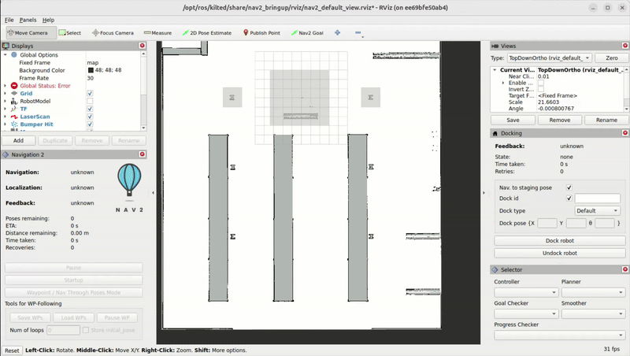
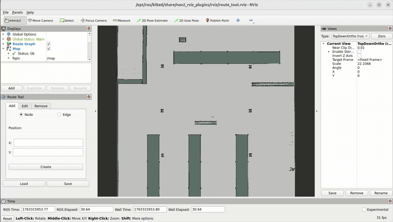
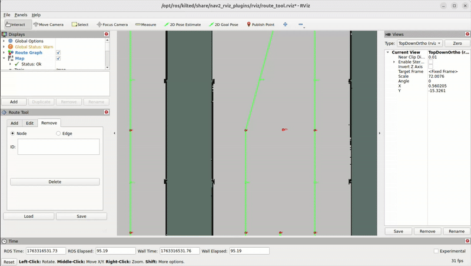

================================================
Route Server Navigation on TurtleBot4 Simulation
================================================

In this section we want to try out the route server feature which was introduced in Kilted.

Therefore you need to switch to Simulation on your local machine.

Here we will explain how to run a simple route graph example.

Preperation
===========

To make use of the Route Server generation in ROS2 one needs to have the latest nav2 installed on the dev container or use an existing kilted container.

Therefore make sure to have pulled the image from:

.. code-block:: bash

   docker pull cinoderobotics/turtlebot4_navigation:kilted-amd64-v1.2.0

Also make sure to have cloned the latest state of the workshop repository.

.. code-block:: bash

   git clone https://github.com/pschnattinger/roscon_de_2025_navigation_workshop.git

The simulation will start a gazebo simulation with a turtlebot4 in a warehouse or depot environment.

Please make sure to give the container enough resources and rights to run the simulation properly.

Usually you need to run

.. code-block:: bash

    xlocal +local:root

to let the container spawn the gazebo window properly.

Starting the Route Server Example
=================================

To start the simulation navigate into the turtlebot_simulation folder and launch the route example launch file.

.. code-block:: bash

   cd roscon_de_2025_navigation_workshop/turtlebot_simulation/
   docker compose -f docker-compose-route-example.yaml up -d

This should start the simulation with the turtlebot4 in the warehouse environment.

The robot should spawn at the start position defined in the route_example_launch.py file and start driving around
according to the defined route and the goal pose given.

You have the option to modify the script which launches the example in the scripts folder of the turtlebot_simulation folder.

The ``route_example_launch.py`` file contains the route graph definition and the start and goal poses. The script is mounted into the docker container so we are able to change environments and start and end positions.

You can change the environment by changing the ``MAP_TYPE`` between ``warehouse`` and ``depot`` and restarting the example.

You can also change the goal poses by modifying the ``goal_pose`` variables in the launch file. It will always drive from the start pose to the goal pose which is closest to the node on the route graph.

.. code-block:: python

    ROUTE_POSES_DICT = {
        "start": {
            "depot": {"x": 7.5, "y": 7.5, "yaw": 0.00},  # 0th node
            "warehouse": {"x": 2.00, "y": -19.65, "yaw": 0.00},  # 0th node
        },
        "goal": {
            "depot": {"x": 20.12, "y": 11.83, "yaw": 0.00},
            "warehouse": {"x": -13.0, "y": 13.0, "yaw": 0.00},
        },
    }
    MAP_TYPE = "warehouse"  # Change this to 'warehouse' for warehouse map

Route Server Tool
=================

Since we can now run the turtlebot4 simulation with the route server feature we can also try to generate our own route graphs.

This can be cone by `Route Server Tool Nav2 <https://docs.nav2.org/tutorials/docs/route_server_tools.html>`_

In our setup we have the graphs of ``depot`` and ``warehouse`` pre-generated in the ``graphs`` folder of the turtlebot_simulation folder.

These graphs are mounted into the docker container so we can use them directly.

To start and modify the graphs you can start the preconfigured docker compose file for the route server tool With

.. code-block:: bash

   cd roscon_de_2025_navigation_workshop/turtlebot_simulation/
   docker compose -f docker-compose-route-server-tool.yaml up -d

This will start the route server tool container.

RViz should open automatically showing the warehouse map.

Please select load and open the graph file under ``/opt/ros/kilted/share/nav2_bringup/graphs/``

You can now modify the graph by adding or removing nodes and edges and modifying the existing ones.

To get the position into the NODE x and y value use the publish point tool in RViz.

Once you are happy with your graph you can save it on the same location so the route example launch file can access it.

If you want to use the ``depot`` environment please make sure to change the ``map.yaml`` in the ``docker-compose-route-server-tool.yaml`` file.

With the graph you can run the ``docker-compose-route-example.yaml`` file again to see your modifications in action.
